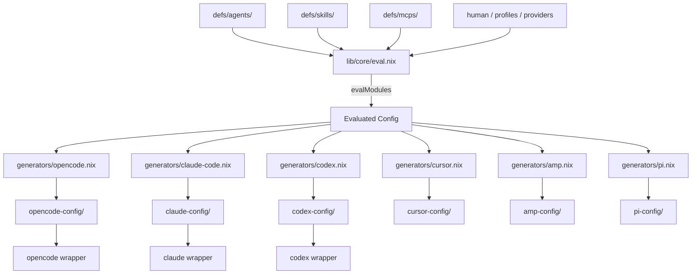
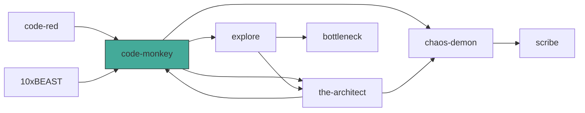

# Architecture

## Overview

nix-agents defines LLM agent teams once in Nix and generates tool-specific configs for OpenCode, Claude Code, Codex, Cursor, Amp, and Pi from a single source of truth.



## Directory Layout

```
nix-agents/
├── flake.nix                  # Entry point: lib, packages, devShells, templates, checks
├── lib/
│   ├── default.nix            # Public API: types, evalModules, mkAgentSystem, mkWrappedTool
│   └── core/
│       ├── types.nix          # Option types: agent, skill, mcp-server, human, provider, profile, hook
│       ├── eval.nix           # lib.evalModules wrapper (wires all modules + specialArgs)
│       ├── builders.nix       # mkAgentSystem (evaluate + generate + build store path)
│       │                      # mkWrappedTool (shell wrapper with credential resolution)
│       └── generators/
│           ├── shared.nix     # mkHumanPreamble (cognitive-style expansion)
│           ├── opencode.nix   # Config → OpenCode YAML frontmatter + opencode.json
│           ├── claude-code.nix# Config → Claude Code frontmatter + settings.json + .mcp.json
│           ├── codex.nix      # Config → Codex JSON frontmatter (experimental)
│           ├── cursor.nix     # Config → .cursor/rules/*.mdc + .cursor/mcp.json (experimental)
│           ├── amp.nix        # Config → amp.json (experimental)
│           ├── pi.nix         # Config → Pi extensions + prompts
│           ├── agents-md.nix  # Config → AGENTS.md orchestration doc
│           └── mermaid.nix    # Config → Mermaid delegation graph
├── lib/
│   └── schemas/               # JSON schemas for generated config validation
├── modules/
│   ├── system.nix             # tierMapping, defaultPermissions, graph validation
│   ├── agent.nix              # Declares `agents` option
│   ├── skill.nix              # Declares `skills` option
│   ├── mcp-server.nix         # Declares `mcpServers` option
│   ├── human.nix              # Declares `human` option (operator context)
│   ├── provider.nix           # Declares `providers` option (credential sources)
│   ├── profile.nix            # Declares `profiles` option (path-based config switching)
│   └── hook.nix               # Declares `hooks` option (event-triggered shell scripts)
├── defs/
│   ├── agents/                # Agent definitions (8 files: code-monkey, the-architect, …)
│   ├── skills/                # Skill definitions (7 files)
│   └── mcps/                  # MCP server definitions (2 files)
├── targets/
│   └── pi/                    # Pi coding agent: extensions (TypeScript), prompts, package
├── services/
│   └── agent-observe/         # Observability service: HTTP + SQLite + MCP server
├── presets/
│   ├── default.nix            # 8-agent team + 7 skills + swe-pruner MCP
│   ├── minimal.nix            # Minimal 2-agent team
│   └── security.nix           # Security-focused preset
└── templates/
    └── default/               # nix flake init template for downstream users
```

## Data Flow

1. **Definition** — Agents, skills, MCP servers, human context, providers, and profiles are plain Nix attrsets in `defs/`.
2. **Composition** — `presets/default.nix` imports all built-in definitions. Downstream users can import a preset and overlay their own.
3. **Evaluation** — `lib/core/eval.nix` calls `lib.evalModules` with all 8 module declarations. `modules/system.nix` validates the agent graph and profile references at eval time.
4. **Profile resolution** — `lib/core/builders.nix` `resolveProfile` filters agents/skills/MCP servers and merges human context, tier mappings, and permission overrides from the named profile.
5. **Generation** — Each generator transforms the evaluated (and optionally profile-filtered) config into tool-specific output files.
6. **Building** — `mkAgentSystem` writes the generated output to a Nix store path. `mkWrappedTool` creates a shell wrapper that resolves credentials, selects the active profile by `$PWD`, and execs the real tool binary.

## Type System

### Agent

| Field | Type | Description |
|-------|------|-------------|
| `description` | `str` | One-line description for tool UIs |
| `model` | `enum ["fast" "balanced" "powerful" "reasoning"] \| str` | Tier or explicit model string |
| `mode` | `enum ["subagent" "primary"]` | Agent role |
| `temperature` | `number` | Sampling temperature (0–2) |
| `reasoningEffort` | `nullOr enum ["low" "medium" "high" "xhigh"]` | Reasoning budget |
| `prompt` | `lines` | System prompt (markdown body) |
| `delegatesTo` | `listOf str` | Names of agents this one can delegate to |
| `permissions` | `submodule` | `edit`, `bash`, `task` (each `permission \| permissionSet`), `webfetch` (`permission`) |
| `skills` | `listOf str` | Skill names to attach |
| `mcpServers` | `listOf str` | MCP server names to attach |
| `orchestration` | `submodule` | `.patterns` (attrsOf lines), `.antiPatterns` (listOf str) |
| `overrides` | `submodule` | `.opencode`, `.claudeCode`, `.codex` (attrsOf anything) |

### Skill

| Field | Type | Description |
|-------|------|-------------|
| `description` | `str` | Skill description |
| `content` | `lines` | Markdown body for SKILL.md |
| `resources` | `attrsOf path` | Bundled files |
| `src` | `nullOr path` | Raw path to existing skill directory |

### MCP Server

| Field | Type | Description |
|-------|------|-------------|
| `enabled` | `bool` | Whether the server is active |
| `type` | `enum ["local" "remote"]` | Transport type |
| `command` | `listOf str` | Command for local servers |
| `package` | `nullOr package` | Nix package providing the binary |
| `url` | `nullOr str` | URL for remote servers |
| `headers` | `attrsOf str` | HTTP headers for remote servers |
| `environment` | `attrsOf str` | Environment variables for local servers |

### Human

| Field | Type | Description |
|-------|------|-------------|
| `name` | `str` | Operator name, prepended as `# Operator: <name>` |
| `cognitiveStyle` | `nullOr enum` | `adhd`, `dyslexia`, `detail-focused`, `high-level`, `visual` — expands to communication rules |
| `context` | `lines` | Free-form preferences injected verbatim |
| `rules` | `listOf str` | Hard rules injected as a numbered list |

### Provider

| Field | Type | Description |
|-------|------|-------------|
| `credentialSource` | `enum ["env" "protonpass" "apple-keychain" "sops"]` | Where the credential lives |
| `credentialRef` | `str` | Key name, env var name, or sops path |
| `envVar` | `str` | Env var the tool expects at runtime (e.g. `ANTHROPIC_API_KEY`) |

### Profile

| Field | Type | Description |
|-------|------|-------------|
| `pathPrefixes` | `listOf str` | Filesystem path prefixes that auto-select this profile |
| `providers` | `listOf str` | Provider names active in this profile |
| `agents` | `listOf str` | Agent names included (empty = all) |
| `skills` | `listOf str` | Skill names included (empty = all) |
| `mcpServers` | `listOf str` | MCP server names included (empty = all) |
| `human` | `nullOr humanType` | Human context override for this profile |
| `tierMapping` | `attrsOf str` | Profile-local tier overrides merged over system tierMapping |
| `permissions` | `nullOr permissionsType` | Profile-local permission defaults |

### Permission

```
permission    = "allow" | "deny" | "ask"
permissionSet = { default : permission; rules : attrsOf permission; }
```

## Graph Validation

`modules/system.nix` runs these checks at Nix evaluation time:

1. Every `delegatesTo` target must name an existing agent
2. No agent delegates to itself
3. Task permission rules only reference existing agents
4. Every skill reference resolves to a defined skill
5. Every MCP server reference resolves to a defined server
6. Every profile's `agents`, `skills`, `mcpServers`, and `providers` lists must reference existing definitions

Invalid graphs produce clear `throw` messages during `nix build` or `nix flake check`.

## Agent Delegation Graph (default preset)



`code-monkey` is the primary agent. All others are subagents reachable through delegation.
