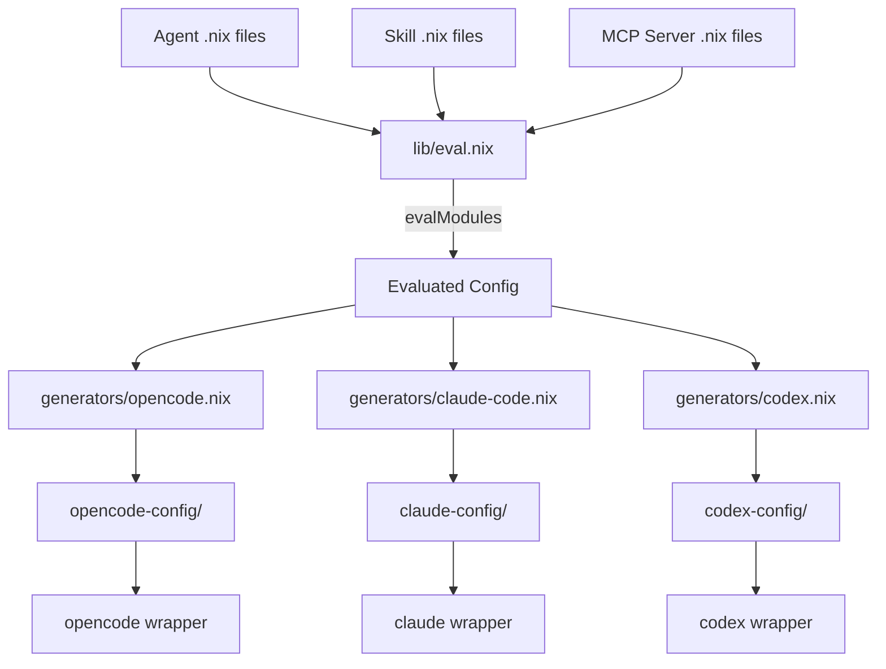
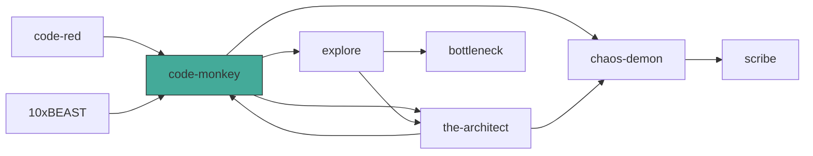

# Architecture

## Overview

nix-agents defines LLM agent teams once in Nix and generates tool-specific configs for OpenCode, Claude Code, and Codex from a single source of truth.



## Directory Layout

```
nix-agents/
├── flake.nix              # Entry point: lib, packages, devShells, templates, checks
├── lib/
│   ├── default.nix        # Public API surface
│   ├── types.nix          # Option types: agent, skill, mcp-server, permission
│   ├── eval.nix           # lib.evalModules wrapper
│   ├── builders.nix       # mkAgentSystem, mkWrappedTool
│   └── generators/
│       ├── opencode.nix   # Config → OpenCode output
│       ├── claude-code.nix# Config → Claude Code output
│       ├── codex.nix      # Config → Codex output
│       └── agents-md.nix  # Config → AGENTS.md orchestration doc
├── modules/
│   ├── agent.nix          # Declares `agents` option
│   ├── skill.nix          # Declares `skills` option
│   ├── mcp-server.nix     # Declares `mcpServers` option
│   └── system.nix         # Graph validation (throws on invalid refs)
├── defs/
│   ├── agents/            # Built-in agent definitions (8 files)
│   ├── skills/            # Built-in skill definitions (5 files)
│   └── mcps/              # Built-in MCP server definitions
├── targets/
│   └── pi/                # Pi coding agent: extensions, prompts, package
├── presets/
│   └── default.nix        # Pre-composed 8-agent team
└── templates/
    └── default/           # nix flake init template
```

## Data Flow

1. **Definition** — Agents, skills, and MCP servers are plain Nix attrsets conforming to types in `lib/types.nix`.
2. **Composition** — `presets/default.nix` imports all built-in definitions. Consumers can import the preset and overlay their own.
3. **Evaluation** — `lib/eval.nix` calls `lib.evalModules` with the module list. `modules/system.nix` validates the graph at eval time (delegation targets exist, no self-loops, skill/MCP refs valid).
4. **Generation** — Each generator (`opencode.nix`, `claude-code.nix`, `codex.nix`) transforms the evaluated config into tool-specific output files.
5. **Building** — `lib/builders.nix` `mkAgentSystem` runs a generator and writes the result to a Nix store path. `mkWrappedTool` creates a shell wrapper that sets up the config and execs the real tool binary.

## Type System

### Agent

| Field | Type | Description |
|-------|------|-------------|
| `description` | `str` | One-line description for tool UIs |
| `model` | `str` | Model identifier (e.g. `"anthropic/claude-sonnet-4-5"`) |
| `mode` | `enum ["subagent" "primary"]` | Agent role |
| `temperature` | `number` | Sampling temperature (0–2) |
| `reasoningEffort` | `nullOr enum` | `null`, `"low"`, `"medium"`, `"high"`, `"xhigh"` |
| `prompt` | `lines` | System prompt (markdown body) |
| `delegatesTo` | `listOf str` | Names of agents this one can delegate to |
| `permissions` | `submodule` | `edit`, `bash`, `task` (each `permission` or `permissionSet`), `webfetch` (`permission`) |
| `skills` | `listOf str` | Skill names to attach |
| `mcpServers` | `listOf str` | MCP server names to attach |
| `orchestration` | `submodule` | `.patterns` (attrsOf lines), `.antiPatterns` (listOf str) |
| `overrides` | `submodule` | `.opencode`, `.claudeCode`, `.codex` (attrsOf anything) |

### Skill

| Field | Type | Description |
|-------|------|-------------|
| `description` | `str` | Skill description |
| `content` | `lines` | Markdown body for SKILL.md |
| `resources` | `attrsOf path` | Bundled files |
| `src` | `nullOr path` | Raw path to existing skill directory |

### MCP Server

| Field | Type | Description |
|-------|------|-------------|
| `enabled` | `bool` | Whether the server is active |
| `type` | `enum ["local" "remote"]` | Transport type |
| `command` | `listOf str` | Command for local servers |
| `package` | `nullOr package` | Nix package providing the binary |
| `url` | `nullOr str` | URL for remote servers |
| `headers` | `attrsOf str` | HTTP headers for remote servers |
| `environment` | `attrsOf str` | Environment variables for local servers |

### Permission

```
permission    = "allow" | "deny" | "ask"
permissionSet = { default : permission; rules : attrsOf permission; }
```

## Graph Validation

`modules/system.nix` runs these checks at Nix evaluation time:

1. Every `delegatesTo` target must name an existing agent
2. No agent delegates to itself
3. Task permission rules only reference existing agents
4. Every skill reference resolves to a defined skill
5. Every MCP server reference resolves to a defined server

Invalid graphs produce clear `throw` messages during `nix build` or `nix flake check`.

## Agent Delegation Graph (default preset)



`code-monkey` is the primary agent. All others are subagents reachable through delegation.
